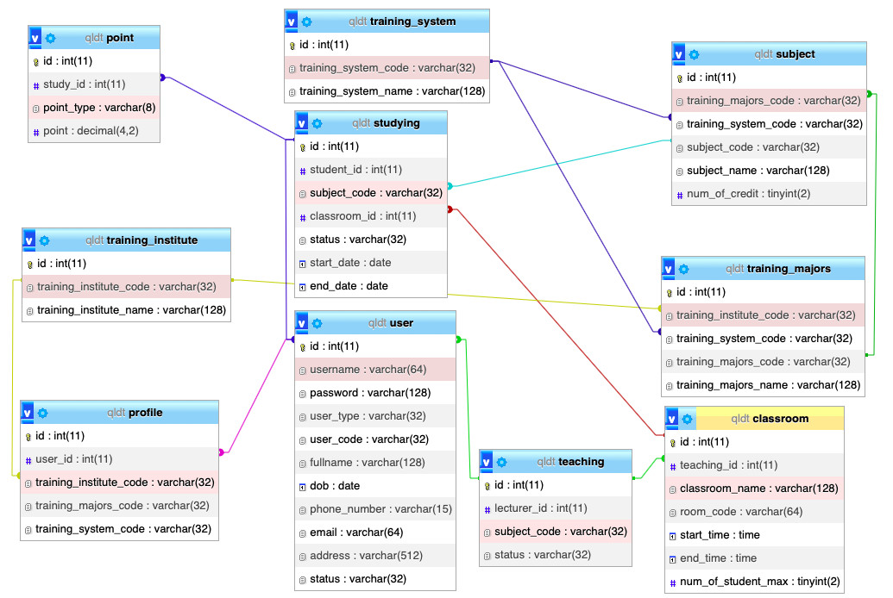

# Bài tập lớn CSDL

## Contributors
- Cao Thị Phương Anh (21020272) - K66J
- Nguyễn Thị Thanh Thuỷ (21020411) - K66J
- Tạ Khánh Phương (21020784) - K66J

## Mô tả Website
- Mục đích: Quản lý trường học
- Chức năng: Chia làm 3 đối tượng sử dụng (Người quản lý - admin, Giảng viên, Sinh viên)
  - Người quản lý: 
    - Xem, thêm, xoá, sửa thông tin cho sinh viên và giảng viên
    - Xem các viện (khoa) đào tạo, ngành đào tạo và học phần của các ngành
  - Giảng viên:
    - Xem thông tin của cá nhân, sinh viên và giảng viên khác
    - Xem danh sách các học phần được chỉ định giảng dạy
    - Nhập điểm cho sinh viên
    - Xem thông tin về học phần, lớp học, thời gian ginảg dạy
  - Sinh viên:
    - Xem hồ sơ cá nhân, thông tin giảng viên và sinh viên khác
    - Đăng ký môn
    - Xem điểm chi tiết
    
## Database

## Cài đặt
- Cài đặt XAMPP
- Chạy file qldt.sql trên phpMyadmin
- Chuyển project vào folder htdocs (trong XAMPP)
- Truy cập http://localhost/(tên project) để chạy Web

